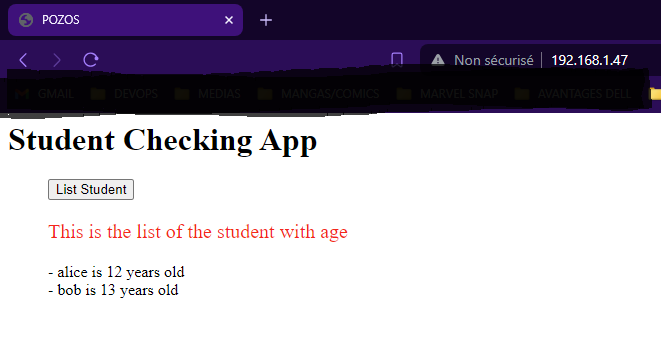

# Mini Projet Docker

## Introduction
Ce projet vise à démontrer les capacités de l'élève à utiliser Docker pour créer et exécuter des applications dans des conteneurs. Ce README fournit un aperçu des étapes suivies pour configurer et exécuter le projet, ainsi que des informations sur les problèmes rencontrés et leur résolution.

## Étapes du projet

1. **Création du repository GitHub :** J'ai créé un repository sur mon GitHub personnel pour travailler et documenter l'ensemble du projet : https://github.com/djemistelrooy93/mini-projet-docker/

2. **Récupération du code source :** Dans un premier temps, j'ai récupéré le code source nécessaire au projet : https://github.com/diranetafen/student-list/

3. **Rédaction du Dockerfile :** Suite à la lecture de la documentation et des requirements, j'ai rédigé le Dockerfile adéquat en rajoutant les informations nécessaires au bon build et au bon lancement de l'image et du conteneur. Cependant, j'ai rencontré des premières difficultés lors du build de l’image suite à l’installation des requirements.txt : certaines librairies devaient être rajoutées lors du build de mon image, notamment `python-dev`, `python3-dev`, `libsasl2-dev`, `python-dev`, `libldap2-dev`, `libssl-dev`.

4. **Lancement du conteneur Docker :** J'ai lancé mon conteneur Docker avec la commande suivante : docker run -d -p 5000:5000 -v ./student_age.json:/data/student_age.json --name api simple_api:v1

5. **Vérification du volume monté :** On peut se connecter au conteneur et vérifier que le volume data a bien été monté avec le bon fichier dedans.

6. **Test final de l'API :** Pour vérifier le bon fonctionnement de l'API, j'ai utilisé la commande suivante : curl -u toto:python -X GET http://172.17.0.2:5000/pozos/api/v1.0/get_student_ages

On peut également tenter d’y accéder via notre navigateur ; une authentification est requise. Une fois les bons credentials indiqués, on obtient bien le contenu du fichier JSON.

7. **Rédaction du docker-compose.yml :** Maintenant, que l'on a rédigé notre Dockerfile et que l'on a obtenu une application fonctionnelle, on va pouvoir industrialiser/automatiser via docker-compose. Voici le résultat de l'exécution de notre fichier docker-compose.yml

Voici ce que l'on obtient lorsque l'on accède à notre application lancée via notre docker-compose via notre navigateur

7. **Création de la registry privée :** J'ai créé une registry privée afin d'y pousser mes images Docker. J'ai opté pour Portus pour l'interface graphique.

1. 8. **Push de l'image sur la registry privée :** J'ai tagué mon image Docker et l'ai poussée sur ma registry privée.

9. **Consultation de l'image via l'interface graphique :** On se connecte à l'interface graphique de Portus pour consulter l'image précédemment créée et poussée dans la registry privée.

###########################################################################################################################################################################################

# Mini Docker Project

## Introduction
This project aims to demonstrate the capabilities of using Docker to create and run applications in containers. This README provides an overview of the steps taken to configure and execute the project, as well as information about encountered issues and their resolution.

## Project Steps

1. **GitHub Repository Creation:** I created a repository on my personal GitHub to work on and document the entire project: [mini-projet-docker](https://github.com/djemistelrooy93/mini-projet-docker/).

2. **Source Code Retrieval:** Initially, I retrieved the necessary source code for the project from: [student-list](https://github.com/diranetafen/student-list/).

3. **Dockerfile Drafting:** Following the documentation and requirements, I drafted the appropriate Dockerfile, adding necessary information for the proper build and launch of the image and container. However, I encountered initial difficulties during the image build due to installation from requirements.txt: certain libraries had to be added during the image build, including `python-dev`, `python3-dev`, `libsasl2-dev`, `python-dev`, `libldap2-dev`, `libssl-dev`.

   

   

4. **Docker Container Launch:** I launched my Docker container with the following command: 
docker run -d -p 5000:5000 -v ./student_age.json:/data/student_age.json --name api simple_api:v1

markdown
Copy code

5. **Mounted Volume Verification:** One can connect to the container and verify that the data volume has been properly mounted with the correct file inside.

6. **Final API Test:** To verify the proper functioning of the API, I used the following command: 
curl -u toto:python -X GET http://172.17.0.2:5000/pozos/api/v1.0/get_student_ages

vbnet
Copy code

Alternatively, one can attempt to access it via the browser; authentication is required. Once the correct credentials are entered, the content of the JSON file is retrieved.

7. **Docker-compose.yml Drafting:** Now that we have drafted our Dockerfile and obtained a functional application, we can industrialize/automate it via docker-compose. Here are the results of executing our docker-compose.yml file:

This is what we get when accessing our application launched via our docker-compose through our browser:

8. **Private Registry Creation:** I created a private registry to push my Docker images. I opted for Portus for the graphical interface.

9. **Pushing the Image to the Private Registry:** I tagged my Docker image and pushed it to my private registry.

10. **Consulting the Image via the Graphical Interface:** We connect to the Portus graphical interface to consult the image previously created and pushed to the private registry.

 

 